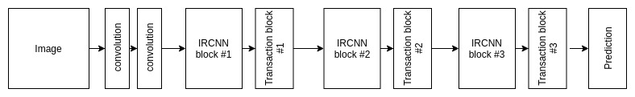
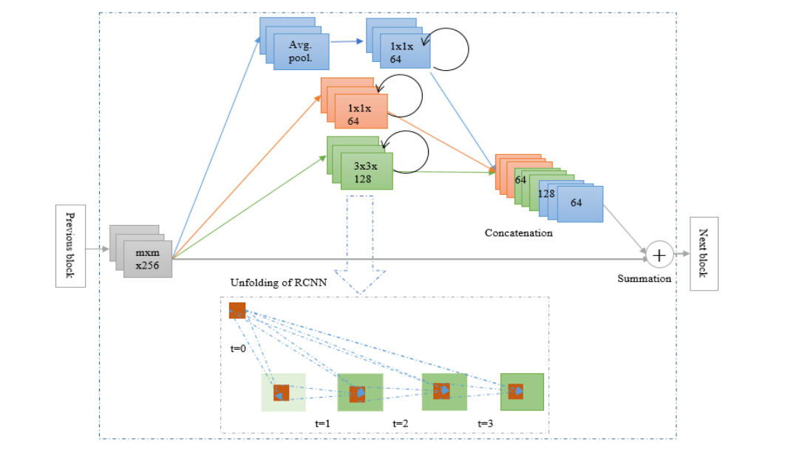

### Inception Recurrent Convolutional Neural Network

The IRCNN architecture consists of general convolution layers, IRCNN blocks, transaction blocks, and a softmax logistic regression layer.

The IRCNN block, performs recurrent convolution operations on different sized kernels.

As the input and output dimensions do not change, this is simply an accumulation of feature maps with respect to the time step considered. This helps to strengthen the extraction of the target features.

In the transaction block, three operations (convolution, pooling, and drop-out) are performed depending upon the placement of the block in the network. According to Figure,  all of the operations are applied in the very first transaction block and second transaction block. The third transaction block consists of convolution, global-average pooling, and drop-out layer. The GlobalAveragePooling layer is used as an alternative to a fully connected layer.

The Stochastics Gradient Descent (SGD) optimization method is used with initial learning rate 0.01

The .ipynb file contains the instructions to train the model on your own dataset. I have used this model on a lymphoma cancer classification dataset <a href="https://github.com/Insiyaa/caMicroscope-tfjs-models/tree/master/lymphoma-cancer-classification">here</a>. Reach out if any issues.
### References
- M. Liang, X. Hu, "Recurrent convolutional neural network for object recognition", CVPR, pp. 3367-3375, 2015.
- "Inception Recurrent Convolutional Neural Network for Object Recognition" -
Md Zahangir Alom, Mahmudul Hasan, Chris Yakopcic, Tarek M. Taha. <a href="https://arxiv.org/abs/1704.07709">[1704.07709]</a>
